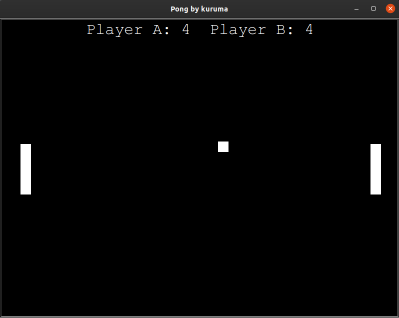

# Pong
Pong game in python using Turtle

## A Glimpse


## Installation
To play this game run following commands on terminal (Ctrl + Alt + T) for Linux
```
git clone https://github.com/kuruma99/Pong.git
cd Pong
python3 pong.py
```

## System Requirements
* python3
* Linux
* You can get the original music file here (bounce.wav)[http://christianthompson.com/sites/default/files/Pong/bounce.wav]

## Additional installations
```
sudo apt-get install python3-tk
```

## Pong
It is a simple pong game implemented using Python. All code has been properly documeted for easy understanding

## Key Features
* Use of Turtle instead of Pygame for beginners
* Use of functional style of programming rather than object oriented for newbies
